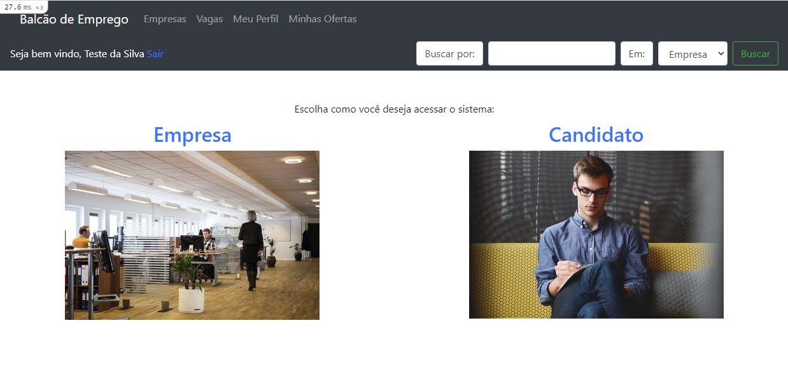

# PROJETO BALCÃO DE EMPREGOS

## Descrição do projeto 

  Desenvolvimento de um site para atender o TreinaDev.

## Quadro KanBan de Planejamento

[Quadro KanBan](https://trello.com/c/WgYzxkV5/1-planejamento-kanban-do-projeto "Trello")

## Funcionalidades

:heavy_check_mark: Colaborador cria uma conta usando e-mail da empresa  

:heavy_check_mark: Colaborador preenche dados da empresa, caso seja a primeira pessoa da empresa a se cadastrar 

:heavy_check_mark: Colaborador cadastra uma nova vaga de empreg  

:heavy_check_mark: Visitante navega pelo site e vê as empresas cadastradas  

:heavy_check_mark: Visitante decide se inscrever para uma vaga 

:heavy_check_mark: Visitante cria sua conta e preenche um perfil para confirmar sua candidatura 

:heavy_check_mark: Colaborador da empresa visualiza as candidaturas recebidas 

:heavy_check_mark: Colaborador da empresa faz uma proposta para um candidato 

:heavy_check_mark: Candidato (agora autenticado) visualiza as propostas recebidas 

:heavy_check_mark: Colaborador ou candidato podem aceitar/reprovar uma candidatur 

## Layout da Aplicação :dash:

## Linguagens, dependencias e libs utilizadas :books:

- [Bootstrap](https://getbootstrap.com/)
- [Ruby on Rails](https://rubyonrails.org/)

## Débito Técnico

Ainda faltam ser concluídas as tarefas abaixo

:memo: Validação dos Formulários e seus campos como CPF, CNPJ, etc...

:memo: Os campos Faixa Salarial e Nivel estão com os valores das chaves ao invés das descrições

:memo: Menu "Hamburguer" do Bootstrap não funciona no celular 

