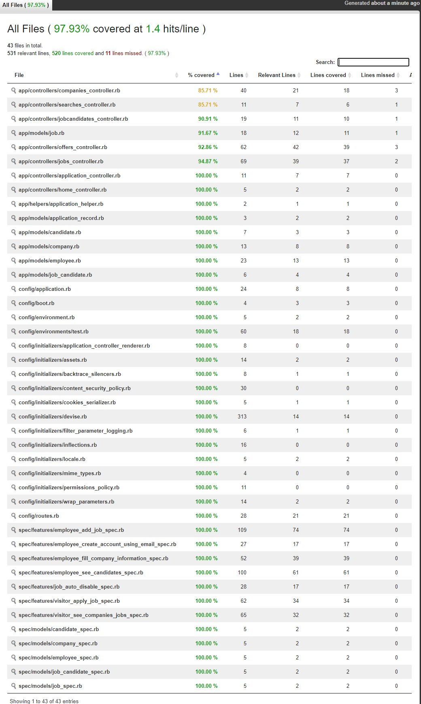

# PROJETO BALCÃO DE EMPREGOS

## Descrição do projeto 

  Desenvolvimento de um site para atender o TreinaDev.

## Quadro KanBan de Planejamento

[Quadro KanBan](https://trello.com/c/WgYzxkV5/1-planejamento-kanban-do-projeto "Trello")

## Funcionalidades

:heavy_check_mark: Colaborador cria uma conta usando e-mail da empresa  

:heavy_check_mark: Colaborador preenche dados da empresa, caso seja a primeira pessoa da empresa a se cadastrar 

:heavy_check_mark: Colaborador cadastra uma nova vaga de empreg  

:heavy_check_mark: Visitante navega pelo site e vê as empresas cadastradas  

:heavy_check_mark: Visitante decide se inscrever para uma vaga 

:heavy_check_mark: Visitante cria sua conta e preenche um perfil para confirmar sua candidatura 

:heavy_check_mark: Colaborador da empresa visualiza as candidaturas recebidas 

:heavy_check_mark: Colaborador da empresa faz uma proposta para um candidato 

:heavy_check_mark: Candidato (agora autenticado) visualiza as propostas recebidas 

:heavy_check_mark: Colaborador ou candidato podem aceitar/reprovar uma candidatur 

## Instalando e rodando a aplicação

No terminal do seu computador, com o [Git](https://git-scm.com/) instalado, baixo o projeto com o comando **git clone https://github.com/mauroroc/projeto01.git**

Feito isso digite **cd projeto01** e então **bundle install**, lembrando que você precisa ter o [Ruby] (https://www.ruby-lang.org/pt/downloads/) instalado.

Depois disso, instale o WebPacker rodando **bundle exec rake webpacker:install**

Feito isso, digite **bundle rails db:migrate** para gerar a estrutura do banco de dados.

E então, rode **bundle rails db:seed** para popular o banco de dados com os dados de exemplo.

Após isso, inicie o servidor com **bundle rails server**

Por fim, acesse seu navegador de preferência no endereço: *http://localhost:3000*

## Layout da Aplicação :dash:

## Linguagens, dependencias e libs utilizadas :books:

- [Bootstrap](https://getbootstrap.com/)
- [Ruby on Rails](https://rubyonrails.org/)

## Débito Técnico

A cobertura de Testes está em 97,93% conforme o SimpleCov

